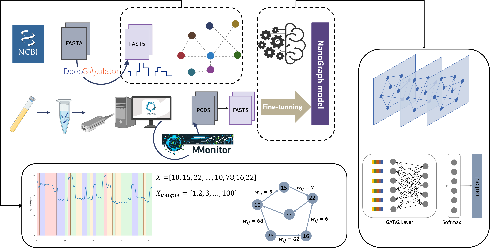

# NanoGraph
This repository is the implementation of 'NanoGraph: Mapping Nanopore Squiggles to Graph Enables Accurate Taxonomic Assignment'.

## Introduction
NanoGraph: A Graph-Based Framework for Nanopore Raw Signal Classification.

